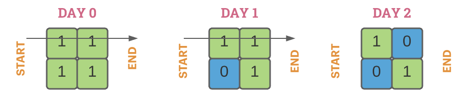
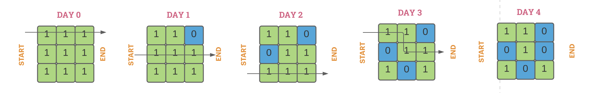

# Stepping Stones

## Problem Statement
Tai Lung has escaped from the prison and fast approaching the village of Po to seek his revenge. To make things worse, he broke the gates of the village’s reservoir leaving the entire village flooded. Sensing the impending danger, Po has started evacuating the village but is faced with a daunting task.

The village is represented as a matrix `A` (**1-based**) with `m` rows and `n` columns. Initially, the entire matrix is covered with **stones** (represented by `1`). Every day any one cell of the matrix `A` will be flooded with water (represented by `0`). Once the cell is flooded its value changes from `1` to `0`. You are given a **1-based** array `floods` where <code>floods[i] = [x<sub>i</sub>, y<sub>i</sub>]</code> represents the coordinates of the cell `A`[<code>x<sub>i</sub></code>][<code>y<sub>i</sub></code>] in matrix `A` that will be flooded on day `i`. A cell once flooded will not be changed back to stone.

Po doesn’t know swimming and can cross the matrix by only stepping on stones. Find the **last** day on which Po can still cross the matrix from the **left** to the **right** ie., starting from **any** cell on the first column and ending at **any** cell on the last column. From a given cell, it is possible to step into one of the **four** neighboring cells (*top*, *bottom*, *left*, or *right*).

Return the _last_ day where it is possible for Po to still cross from the *left* to the *right* by only stepping on *stones*.

## Input
The first line of input contains two integers `m` and `n` denoting the number of rows and columns of matrix `A` respectively.
The next <code>m * n</code> lines contains two integers <code>x<sub>i</sub></code> and <code>y<sub>i</sub></code> denoting the coordinates of the cell of matrix `A` that gets flooded on day `i`.
## Output
An integer denoting the last day where it is possible to cross the matrix from the left to the right by only stepping on stones.
## Constraints

* <code>2 <= m, n <= 300</code>
* <code>4 <= m * n <= 5 * 10<sup>4</sup></code>
* <code>floods.length == m * n</code>
* <code>1 <= x<sub>i</sub> <= m</code>
* <code>1 <= y<sub>i</sub> <= n</code>

## Examples

### Input 0

```
2 2
2 1
1 2
1 1
2 2
```
### Output 0
```
1
```
### Explanation
After day `1` it is not possible to cross the matrix from the left to the right by stepping only on stones (represented by green cells).
### Input 1

```
2 2
2 2
2 1
1 2
1 1
```
### Output 1
```
2
```
### Input 2

```
3 3
1 3
2 1
3 2
2 3
3 3
3 1
2 2
1 1
1 2
```
### Output 2
```
3
```
### Explanation
On day `3`, we can cross the matrix from the left to the right by following the path `(1,1) -> (1,2) -> (2,2) -> (2,3)`. There is no valid path from day `4` onwards.